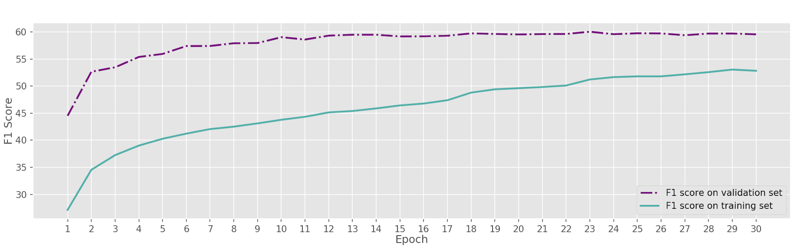

# Using enhenced BiDAF++ on QUAC

## Descriptions
An original BiDAF++ model uses Char-CNN for character embedding and GLoVe for word embedding. It is also equipped with contextualized embeddings and self attention. In this model, marker embeddings corresponding to previous answer words are used, while question turn numbers are encoded into question embeddings.

## Architecture of enhenced BiDAF++

    
 

 
### Self-Attention layers from BiDAF++

First, the input is passed through a linear layer with ReLU activations. Then, it passes through a bi-directional GRU or LSTM. After that, we apply attention mechanism between the context and itself as following:

Let hi, hj be the vectors for context word i and word j and nc be the lengths of the context. Then compute attention between the two words as:

## Prerequisites

## Usage
## Dataset
## Learning curve on training and validation datasets

    

