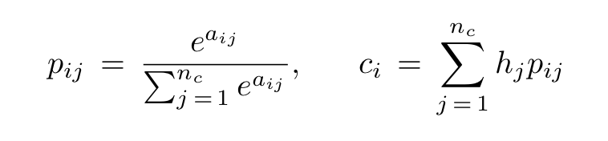
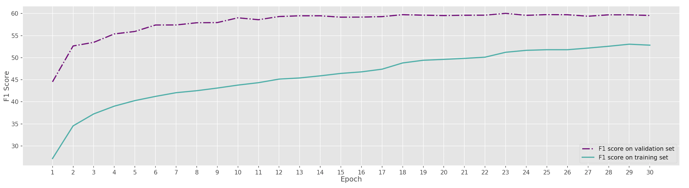
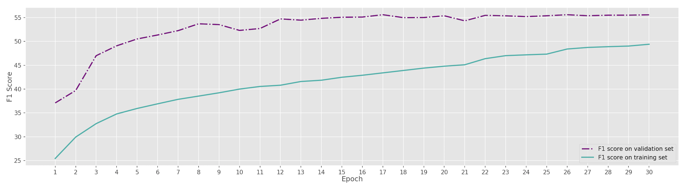

# Using enhenced BiDAF++ on QUAC

## Descriptions
An original BiDAF++ model uses Char-CNN for character embedding and GLoVe for word embedding. It is also equipped with contextualized embeddings and self attention. In this model, marker embeddings corresponding to previous answer words are used, while question turn numbers are encoded into question embeddings.

## Architecture of enhenced BiDAF++
<p align="center">
    
</p>

### Embedding layers from BiDAF++

We aimed to apply ELMo or BERT embedding to the original embeddings.


Let ELMo<sub>k</sub> be a ELMo vector, x<sub>k</sub> denote a original embedding vector and h<sub>k</sub> present a contextual vector generated by bi-LSTM layer. Then we can use ELMo enhanced representation [x<sub>k</sub>; ELMo<sub>k</sub>] instead of x<sub>k</sub>. Also, replace h<sub>k</sub> with [h<sub>k</sub>; ELMo<sub>k</sub>].
We do the same thing when using BERT embedding.

ELMo ver:[options_file](https://s3-us-west-2.amazonaws.com/allennlp/models/elmo/2x4096_512_2048cnn_2xhighway/elmo_2x4096_512_2048cnn_2xhighway_options.json)
      and [weight_file](https://s3-us-west-2.amazonaws.com/allennlp/models/elmo/2x4096_512_2048cnn_2xhighway/elmo_2x4096_512_2048cnn_2xhighway_weights.hdf5)
BERT ver: [bert-large-cased](https://s3.amazonaws.com/models.huggingface.co/bert/bert-large-cased-vocab.txt)
### Self-Attention layers from BiDAF++

First, the input is passed through a linear layer with ReLU activations. Then, it passes through a bi-directional GRU or LSTM. After that, we apply attention mechanism between the context and itself as following:

Let h<sub>i</sub>, h<sub>j</sub> be the vectors for context word i and word j and nc be the lengths of the context. Then compute attention between the two words as:
<p align="center">
    
</p>

where w<sub>1</sub>,w<sub>2</sub>, and w<sub>3</sub> are learned vectors and ⊙ is element-wise multiplica- tion. In this case, we set a<sub>ij</sub> = −inf if i = j. Then, compute an attended vector c<sub>i</sub> for each context token as:
<p align="center">
    
</p>

Compute a context-to-context vector t<sub>c</sub>:
<p align="center">
    
</p>

The output of this layer is built concatenating h<sub>i</sub>, c<sub>i</sub>, h<sub>i</sub> ⊙ c<sub>i</sub> and t<sub>c</sub> ⊙ c<sub>i</sub>,
additionally summed with the input before ReLU.
## Platform and tools
### Launching a Deep Learning VM on GCP
- 2 vCPUs with 13GB memory
- 1 NVIDIA Tesla V100 GPU
- PyTorch 1.0 + fast.ai 1.0(CUDA 10.0)
- Install NVIDIA GPU driver automatically on first startup 

### Setting up an [allennlp](https://github.com/allenai/allennlp) virtual environment

1.  Create a Conda environment with Python 3.6

    ```bash
    conda create -n allennlp python=3.6
    ```

2.  Activate the Conda environment. You will need to activate the Conda environment in each terminal in which you want to use AllenNLP.

    ```bash
    source activate allennlp
    ```


## Usage

### Dataset
[Train data](https://s3.amazonaws.com/my89public/quac/train_5000.json)  
[Validation data](https://s3.amazonaws.com/my89public/quac/val.json)

### Command
```
nohup allennlp train <your_path_to_jsonnet_file>  --serialization-dir <your_path_to_log_file> > output.log &
```
## Learning curves
Enhenced model with Bert
<p align="center">
    
</p>
Baseline model
<p align="center">
    
</p>


