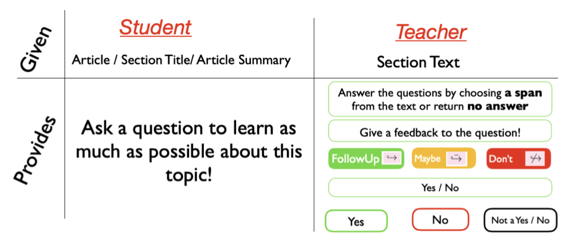
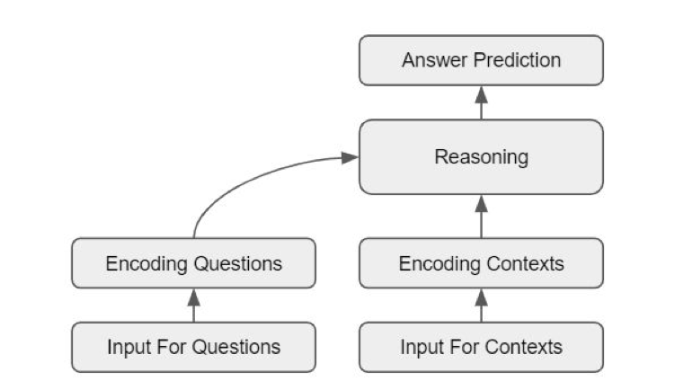
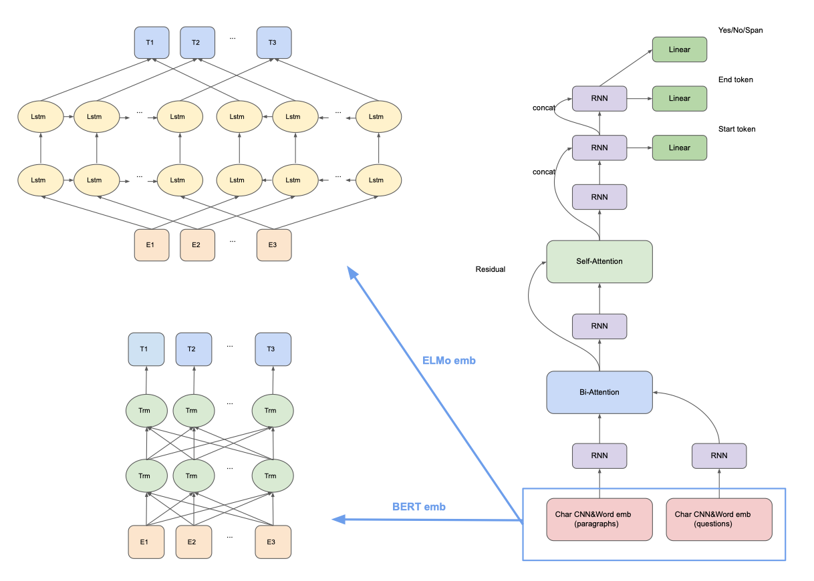

# Question Answering In Context
Question Answering (QA) has long been a promising yet challenging task, and a large number of work has been done in this area. However, simple QA tasks such as extracting answer spans from a given text have been criticized as "shallow pattern recognition", which does not equip machines with the capability of reading. Recently, Conversational Question Answering has been proposed to address this issue. In this task, a program needs to not only answer questions, but also answer them in a conversational style.

In this project, we are going to use deep neural networks to address [QuAC](https://quac.ai/), one of these Conversational QA datasets. We are going to train existing models on QuAC and compare their pros and cons. We will also use models effective on other related datasets and invent new models involving different network architectures or mechanisms. We hope that we could obtain a better, and even state-of-the-art performance.

## QuAC

    
      
    Figure 1: Task setup of QuAC.

[Question Answering in Context(QuAC)](https://quac.ai/) is a newly proposed dataset with regards to conversational QA. The task is to answer a question in a conversation given a context and historical questions and answers in the conversation. Compared with the former ones, its questions are often highly context-dependent, elliptical, and even unanswerable. The architecture o typical QA models for QuAC:

    
      
    Figure 2: Baseline QA Model for QuAC.

## Problem Formulation
The input of the problem is a context as background and a sequence of text-free questions, each question has two binary properties “yes/no” and “followup”. The first property indicates whether the question can be answered by affirmation “yes” or “no”. The second property indicates whether the question is a follow-up of previous questions. 

The output is the answer of each question. The answer must be a span of context unless the question is a “yes/no“ question, or the answer should be “cannot answer“ if the answer cannot be found in given context.

## Approaches
### FlowQA

[FlowQA](https://github.com/momohuang/FlowQA) has been shown to have a considerable good performance on conversational question-answering tasks such as CoQA and QuAC. Firstly, we re-run the FlowQA model and investigate why it has great performance and why it is special. 

Why does FlowQA work? We believe that it is because of its "flow" operation, which uses a LSTM (or GRU) to represent context words in terms of question turns. By using "flow" operation, FlowQA could capture and retain conversational information. Since
conversations are in fact sequences, it is a natural, yet smart, idea, to encode conversational information in this way.

#### [FlowQA + Attention Over Flow](FlowQA_Attention)

We believe that applying attention here should be considered, because not every historical conversation is important. 
When new questions are posted, it is highly likely that only several previous questions are involved, instead of all. By adding attention in the "flow" operation, we could align new representations with previous useful ones. We would like to call it "attention-over-flow".

#### [FlowQA + Coreference](FlowQA_Coreference)

Since the QuAC data set may contain many coreference in context and also in conversations, our intuition is that we could exploit the coreference resolution model to improve FlowQA model. 
Below figure shows the improved model where the gray blocks are the existing FlowQA model and the blue blocks are coreference model we added. 
Our experiment shows that, with coreference model, the F1 is slightly better.

    

### [SD-Net](SDNet)
A contextualized attention-based deep neural network developed by Microsoft. It is originally evaluated on another question answering dataset CoQA, and it is the first model that reaches in-domain F1 score higher than 80% (80.7%) on CoQA. Here we are applying this model on QuAC dataset. Since the format of two datasets are different, we need to preprocess data carefully.

### [BiDAF++](BiDAF)
An original [BiDAF++](https://arxiv.org/abs/1710.10723) model uses Char-CNN for character embedding and GLoVe for word embedding. It is also equipped with contextualized embeddings and self attention. In this model, marker embeddings corresponding to previous answer words are used, while question turn numbers are encoded into question embeddings. We intend to append ELMo or BERT embedding to word embeddings and contextualized embeddings to get better performance.

    

## Results
| Model | F1 | Remark |
| ------------- | ------------- | ------------- |
| **FlowQA Baseline** | 64.24| Baseline in one experiment |
| FlowQA + Coreference | 62.50 | Baseline=62.26 in another experiment|
| FlowQA + Attention on Flows | 64.35 |  |
| **BiDAF++ Baseline** | 55.59 | |
| ELMO + BiDAF++ | 58.40 |  |
| BERT + BIDAF++ | 60.04 |  |
| **SDNet** | 33.13 |  |

## Conclusion
* **FlowQA+Attention Over Flow**: adding attention layers over flow operation layer slightly improves the FlowQA model. We believe that it is because the representations generated in this way focus more on recent dialogs and help resolve coreferences.

* **FlowQA+Coreferece**: Adding vector representation that encodes the coreference in long context can increase the performance of the model for task involving complex dependencies (context and dialogue)

* **Enhancing BiDAF++**: Appending ELMo or BERT embedding to word embeddings and contextualized embeddings. Because ELMo extracts context features from language model and BERT uses pre-trained token embedding model which could perform better than GLoVe on QuAC dataset, these two embeddings could enhance the model performance.

* **SDNet**: SDnet is not originally applied on QuAC dataset. So we adjusted the format of dataset so it can be fitted on SDNet. However the result is not as good as we expected. We can try to figure out issues and improve this model in future.

## References

* [Flowqa: Grasping flow in history for conversational machine comprehensionn.](https://arxiv.org/abs/1810.06683) By Huang H Y, Choi E, Yih W.

* [Quac: Question answering in context.](https://arxiv.org/abs/1808.07036) By Choi E, He H, Iyyer M, et al. 

* [Bidirectional attention flow for machine comprehension](https://arxiv.org/abs/1611.01603) by Minjoon Seo et. al.
* [Simple and effective multi-paragraph reading comprehension](https://arxiv.org/abs/1710.10723) by Christopher Clark et. al.
* [Deep contextualized word representations](https://arxiv.org/abs/1802.05365) by Matthew E. Peters et. al.
* [Bert: Pre-training of deep bidirectional transformers for language understanding](https://arxiv.org/abs/1810.04805) by  Jacob Devlin et. al.
* [End-to-end Neural Coreference Resolution](https://arxiv.org/abs/1707.07045) by Lee et. al.

