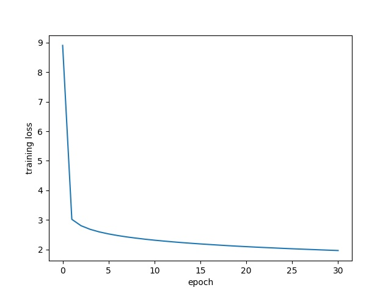
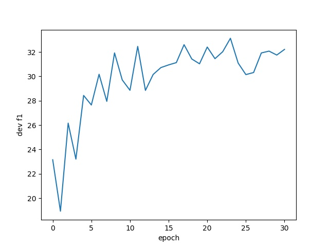

# SDNet
[SDNet](https://arxiv.org/abs/1812.03593) is a contextualized attention-based deep neural network developed by Microsoft. It is originally evaluated on another question answering dataset [CoQA](https://stanfordnlp.github.io/coqa/), it is the first model that reaches in-domain F1 score higher than 80% (80.7%) on CoQA.

## Difference between CoQA and QuAC
Since the format of dataset is different between CoQA and QuAC, we need to convert the format first to let SDNet work on QuAC. Unlike QuAC, the answers in CoQA are context-free. However, SDNet still need to generate an answer span from text, so we can take this as output on QuAC. Moreover, questions in CoQA don’t have properties such as “follow up” and “yes/no”, but all questions are possible to be related to previous questions and answers. Original SDNet model prepends 2 rounds of previous questions and answers to obtain the best F1 score, so we will keep this behavior and ignore “follow up” property. Also, SDNet essentially needs to compute the probability of answer being affirmation “yes” or “no”, and “No answer” (“unknown” in CoQA), which we can use directly on QuAC.

## Usage
In preprocess folder there is a script to convert QuAC data to CoQA format.

For detailed usage please refer to [SDNet GitHub page](https://github.com/Microsoft/SDNet)

## Result and conclusion
Training loss and development set F1 score are shown below: 

    

    

Unfortunately, the reult of SDNet is not as good as we expected. We only get 33.13 F1 score on development set. We tried to feagure out the reason why this happends (such as format and preprocess issue) but couldn't make any significant improvement on that. We can set this as a future work and continue working on this.

## References

* [SDNet: Contextualized Attention-based Deep Network for Conversational Question Answering](https://arxiv.org/abs/1812.03593) by Chenguang Zhu et. al.
